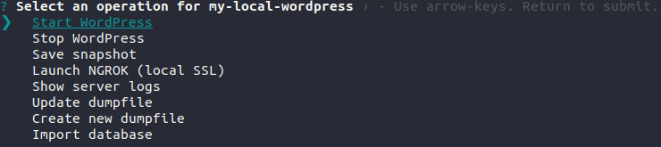
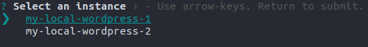

# WordPress Docker Local Environment CLI
The purpose of this library is for easy creation and management of local WordPress development environments with Docker. Essentially, this library uses `visiblevc`'s excellent [Docker images](https://github.com/visiblevc/wordpress-starter) as the base and adds CLI options which make environment management considerably easier. With most other tools the user must manually create/edit/delete `docker-compose.yml` files. This library foregoes that option in favor of `JSON` files specifically made for managing WordPress environments. The user does not need to have any prior knowledge of Docker to use this tool.

Features of this library include:
- Mounting plugins/themes as Docker volumes **regardless of their path on the host system**
- Automatic database creation from an SQL dump file on start-up
- Automatic URL replacement after an SQL dump on start-up
- Downloading and installing plugins/themes **automatically** on start-up
- Downloading and installing private plugins/themes via SSH/FTP **automatically** on start-up
- XDebug built-in for easy debugging of local environments **using the same port number for every environment**
- Easy exporting of an environments database as a `.sql` dump file
- `ngrok` support for easy SSL testing on localhost
- A single `phpMyAdmin` container for all of your environments
- Configurable PHP environment variables
- Ability to specify PHP version (`7.2`, `7.3`, or `7.4`)
- Ability to specify WordPress version
- Local SMTP mail server with [MailHog](https://github.com/mailhog/MailHog)

This library is **only for managing development environments** and is not intended for creating production ready containers.

## Table of Contents
-   [Requirements](#requirements)
-   [Installation](#installation)
-   [Quickstart Guide](#quickstart-guide)
-   [Examples](./examples/)
-   [CLI Usage](#cli-usage)
-   [Environments](#environments)
    -   [Logging in](#logging-in)
    -   [Lifecycle Details](#lifecycle-details)
-   [MailHog](#mailhog)
-   [PHP Debugging](#php-debugging)
-   [JSON Structure](#json-structure)
    -   [`instanceName`](#---instancename)
    -   [`containerPort`](#---containerPort)
    -   [`phpVersion`](#---phpVersion)
    -   [`wordpressVersion`](#---wordpressVersion)
    -   [`locale`](#---locale)
    -   [`customInitScripts`](#---customInitScripts)
    -   [`database`](#---database)
        -   [`mysqlDumpfile`](#---databasemysqldumpfile)
        -   [`flushOnRestart`](#---databaseflushonrestart)
        -   [`dbName`](#---databasedbname)
        -   [`dbPrefix`](#---databasedbprefix)
    -   [`env`](#---env)
    -   [`downloadPlugins`](#---downloadplugins)
    -   [`downloadThemes`](#---downloadthemes)
    -   [`localPlugins`](#---localplugins)
    -   [`localThemes`](#---localthemes)
    -   [`ftp`](#---ftp)
        -   [`confname`](#---ftpconfname)
        -   [`confpath`](#---ftpconfpath)
        -   [`plugins`](#---ftpplugins)
        -   [`themes`](#---ftpthemes)
    -   [`ssh`](#---ssh)
        -   [`confname`](#---sshconfname)
        -   [`confpath`](#---sshconfpath)
        -   [`plugins`](#---sshplugins)
        -   [`themes`](#---sshthemes)
-   [FTP/SSH Config Files](#ftpssh-config-files)
    -   [`FTP`](#ftp-config-files)
    -   [`SSH`](#ssh-config-files)

## Requirements
- node・npm
- docker

## Installation
Install globally with `npm`.
```sh
$ npm -g install @aivec/wp-docker-dev-factory
```

## Quickstart Guide
To spin-up a minimal environment, create a file named `wp-instances.json` with the following contents:
```json
{
  "instanceName": "my-local-wordpress",
  "containerPort": 8000,
  "locale": "en_US",
  "downloadPlugins": ["wordpress-plugin-1", "wordpress-plugin-2"],
  "downloadThemes": ["wordpress-theme-1", "wordpress-theme-2"],
  "localPlugins": [
    "/absolute/path/to/plugin/directory",
    "relative/path/to/plugin/directory",
    "../relative/path/to/plugin/directory"
  ],
  "localThemes": [
    "/absolute/path/to/theme/directory",
    "relative/path/to/theme/directory",
    "../relative/path/to/theme/directory"
  ]
}
```
Where:
- [`instanceName`](#---instancename) is the title of your website.
- [`containerPort`](#---containerPort) is the port number the environment will expose. In this case the final URL will be `localhost:8000`.
- [`locale`](#---locale) is the language you want for the WordPress install.
- [`downloadPlugins`](#---downloadplugins) is a list of any number of publicly available WordPress plugins to be downloaded.
- [`downloadThemes`](#---downloadthemes) is a list of any number of publicly available WordPress themes to be downloaded.
- [`localPlugins`](#---localplugins) is a list of absolute or relative paths to any number of local plugin folders.
- [`localThemes`](#---localthemes) is a list of absolute or relative paths to any number of local theme folders.

After setting up your config file, invoke the CLI tool from within the folder where your `wp-instances.json` file is saved:
```sh
$ aivec-wpdocker
```

A select prompt will appear:



Press the enter key on `Run Containers` and wait for the containers to be created (if this is your first time it might take a while). After the containers are created, open your browser and navigate to [localhost:8000/wp-admin](localhost:8000/wp-admin).

You should see the WordPress login screen. Login with the default username and password `root`.
That's it!

A full example config can be found [here](examples/wp-instances.json). For a detailed description of every setting, refer to the [JSON Structure section](#json-structure).

## CLI Usage
The CLI is completely interactive. There are two ways to use it:
1. With no arguments
2. With a relative/absolute path

If you invoke `aivec-wpdocker` with no arguments, it will look for a `wp-instances.json` file in the current directory.

Alternatively, you can pass a relative or absolute path as an argument to tell the CLI where it should look for a `wp-instances.json` file. For example, assuming you have a `wp-instances.json` file in a folder called `configs` relative to the current directory, you would invoke the CLI like so:
```sh
$ aivec-wpdocker configs
```
The CLI has seven different operations:
| Operation | Description |
| ----- | ----------- |
| `Run Containers` | This will create and run the `MySQL` and `phpMyAdmin` containers if they are not already created and running, as well as start the `WordPress` container. If the environment's `WordPress` container is already running the CLI will abort with an error. Note that exiting with Ctrl+c will only stop the log stream, not the containers |
| `Stop WordPress Container` | This will stop the `WordPress` container for the selected environment. It **will not** stop the `MySQL` and `phpMyAdmin` containers. |
| `Launch NGROK (local SSL)` | This will start the `ngrok` client for local SSL. Ctrl+c to stop the client. If you use `ngrok`, we **highly recommend** creating a free account on [ngrok.com](https://ngrok.com) so that you get more connections per minute. |
| `Log WordPress Container` | By default, when you start a `WordPress` container with `Run Containers`, it will stream the `Apache` logs to standard input. You can use this command to pipe the log stream to your console again if you have exited the stream. |
| `Overwrite host dumpfile with DB of currently mounted volume` | This will only work if you specified [mysqlDumpfile](#---databasemysqldumpfile) in your config. By invoking this command, the dumpfile, which is mounted as a volume in the container, will be overwritten with a dump of the database of the selected environment |
| `Create new dumpfile with DB of currently mounted volume` | This will create a dumpfile from the database of the selected environment and prompt the user to name the dumpfile. The resultant dumpfile will be placed in a folder called `dumpfiles` in the same folder as `wp-instances.json`. If a `dumpfiles` folder does not already exist, it will be created. |
| `Replace plugin volume with deployment ready bundle (Toggle)` | **NOT YET IMPLEMENTED**. This operation will prompt the user to select a plugin from a list of mounted plugins for the selected environment. If the plugin contains a script named `bundle.sh`, it will be executed and the contents of the generated `.zip` file will temporarily replace the plugin folder contents. Running this command again will revert the plugin back to its original contents. If a `bundle.sh` script does not exist or cannot be executed, an error will occur. |

## Environments
Config files can contain any number of environments. To do so, wrap your config objects in an array:
```json
[
    {
        "instanceName": "my-local-wordpress-1",
        "containerPort": 8000,
        "locale": "en_US",
    },
    {
        "instanceName": "my-local-wordpress-2",
        "containerPort": 8010,
        "locale": "en_US",
    },
]
```
The CLI will then prompt you to choose which environment to use:



Every environment has exactly one `WordPress` container associated with it. Conversely, there is only one `MySQL` and `phpMyAdmin` container used for the databases of *all* `WordPress` environments. The naming pattern for containers is as follows:
| Container | Name | Example |
| ----- | ---- | ------ |
| `MySQL` | aivec_wp_mysql | |
| `phpMyAdmin` | aivec_wp_pma | |
| `WordPress` | [instanceName](#---instancename) + -[phpVersion](#---phpversion)_dev_wp | test-wordpress-7.3_dev_wp |
### Logging in
You can access `phpMyAdmin` at [localhost:22222](localhost:22222) with the following login information:
- Username: `root`
- Password: `root`

For `WordPress` environments that **do not** specify a [mysqlDumpfile](#---databasemysqldumpfile), the login information is the same:
- Username: `root`
- Password: `root`
### Lifecycle details
The database for each WordPress environment will only be created **the first time that environment is started**, regardless of whether you set a [mysqlDumpfile](#---databasemysqldumpfile) or not. This is because even if you [stop the WordPress container](#cli-usage), the `MySQL` container will continue to run. The next time you [run the containers](#cli-usage), the database will already exist so it will not be created. If you want the database to be re-created every time you [run the containers](#cli-usage), set [flushOnRestart](#---databaseflushonrestart) to `true`.

## MailHog
Emails sent via WordPress' built-in `wp_mail` function are caught by [MailHog](#mailhog). All outgoing email can be viewed in a web UI at [localhost:8025](localhost:8025)

## PHP Debugging
Any environment you create will have `XDebug` installed and configured by default listening on port `9900`. Visual Studio Code users can debug with the [PHP Debug extension](https://marketplace.visualstudio.com/items?itemName=felixfbecker.php-debug). Create a `launch.json` file and place it either in the `.vscode` directory of a workspace folder for a plugin/theme, or the `.vscode` directory of a workspace folder specifically for managing PHP debugging.

For users who have many plugins and themes scattered across their filesystem, we recommend creating a workspace folder for managing path mappings of all of those environments with a `launch.json` file like the following:
```json
{
  "version": "0.2.0",
  "configurations": [
    {
      "name": "Listen for XDebug",
      "type": "php",
      "request": "launch",
      "port": 9900,
      "pathMappings": {
        "/var/www/html/wp-content/plugins/my-plugin": "/home/user/path/to/my-plugin",
        "/var/www/html/wp-content/themes/my-theme": "/home/user/path/to/my-theme"
      }
    }
  ]
}

```
For users who would rather have a separate `launch.json` file for each of their plugin/theme workspaces, the file would look something like this:
```json
{
  "version": "0.2.0",
  "configurations": [
    {
      "name": "Listen for XDebug",
      "type": "php",
      "request": "launch",
      "port": 9900,
      "pathMappings": {
        "/var/www/html/wp-content/plugins/my-plugin": "{workspaceRoot}"
      }
    }
  ]
}
```
Some users prefer to keep all of their plugins and themes in a local WordPress installation folder. For those users, only one `launch.json` file is required:
```json
{
  "version": "0.2.0",
  "configurations": [
    {
      "name": "Listen for XDebug",
      "type": "php",
      "request": "launch",
      "port": 9900,
      "pathMappings": {
        "/var/www/html/wp-content": "/absolute/path/to/my/local/wordpress/wp-content"
      }
    }
  ]
}
```

## JSON Structure
Reference for the `wp-instances.json` config file.
### -- instanceName
- *Required*
- *Type: `String`*
- Description: The `instanceName` becomes the title of your website. Note that even if you import a database with an SQL dumpfile that contains a WordPress install with a different title, `instanceName` will override it.
<hr>

### -- containerPort
- *Required*
- *Type: `Number`*
- Description: This is the port number for the WordPress installation. The final URL is `localhost` with this port number appended. A `containerPort` of 8000 would result in `localhost:8000`.
<hr>

### -- phpVersion
- *Optional*
- *Type: `String`*
- *Default: `7.3`*
- Description: This is the PHP version Apache will use. Possible values are `7.2`, `7.3`, and `7.4`.
<hr>

### -- wordpressVersion
- *Optional*
- *Type: `String`*
- *Default: `latest`*
- Description: Specify the WordPress version to install. Accepts any valid semver number, `latest`, or `nightly` for beta builds. Note that `nightly` builds only support the `en_US` [locale](#---locale). If you set this to `nightly` and the [locale](#---locale) is not `en_US`, `en_US` will be used anyways.
<hr>

### -- locale
- *Optional*
- *Type: `String`*
- *Default: `en_US`*
- Description: This is the locale used by WordPress to determine which language to use.
<hr>

### -- customInitScripts
- *Optional*
- *Type: `String[]`*
- Description: May be any number of absolute or relative paths to `sh` or `bash` scripts to be executed at the end of environment creation. Note that absolute paths are resolved **starting from your home directory** and relative paths are resolved **starting from the folder of the `wp-instances.json` config file**
<hr>

### -- database
- *Optional*
- *Type: `Object`*
### -- database.mysqlDumpfile
- *Optional*
- *Type: `String`*
- Description: A relative or absolute path to a `MySQL` dump file with the extension `.sql`. Note that absolute paths are resolved **starting from your home directory** and relative paths are resolved **starting from the folder of the `wp-instances.json` config file**
### -- database.flushOnRestart
- *Optional*
- *Type: `Boolean`*
- *Default: `false`*
- Description: If `true`, the database will be re-created every time the WordPress container is stopped and started again.
### -- database.dbName
- *Optional*
- *Type: `String`*
- Description: By default, if you do not specify a `mysqlDumpfile` then the database name will become the `instanceName`. If you do specify a `mysqlDumpfile` and the database name therein is different than the `instanceName`, you must define this property with the database name defined in the dump file.
### -- database.dbPrefix
- *Optional*
- *Type: `String`*
- *Default: `wp_`*
- Description: This is the prefix for table names. Again, if `mysqlDumpfile` is specified but the table prefix therein differs from the default, you must define this property.
#### Example
```json
{
    "database": {
        "mysqlDumpfile": "dumpfiles/testdatabase.sql",
        "flushOnRestart": true,
        "dbName": "dbname",
        "dbPrefix": "dbprefix_"
    }
}
```
<hr>

### -- env
- *Optional*
- *Type: `Object`*
- Description: May be any number of arbitrary key-value pairs to be set as PHP environment variables at start-up. The environment variables can then be accessed in PHP via the PHP environmment global `$_ENV`
<hr>

### -- downloadPlugins
- *Optional*
- *Type: `String[]`*
- Description: May be any number of plugins that you want to be installed during environment creation. You must use the plugin `slug` (name of the plugins base folder), not the name. Also, the plugin must be available on `wordpress.org`.
<hr>

### -- downloadThemes
- *Optional*
- *Type: `String[]`*
- Description: May be any number of themes that you want to be installed during environment creation. You must use the theme `slug` (name of the themes base folder), not the name. Also, the theme must be available on `wordpress.org`.
<hr>

### -- localPlugins
- *Optional*
- *Type: `String[]`*
- Description: May be any number of relative or absolute paths pointing to local plugins that you want mapped into the container. Note that absolute paths are resolved **starting from your home directory** and relative paths are resolved **starting from the folder of the `wp-instances.json` config file**
<hr>

### -- localThemes
- *Optional*
- *Type: `String[]`*
- Description: May be any number of relative or absolute paths pointing to local themes that you want mapped into the container. Note that absolute paths are resolved **starting from your home directory** and relative paths are resolved **starting from the folder of the `wp-instances.json` config file**
<hr>

### -- ftp
- *Optional*
- *Type: `Object[]`*
- Description: `ftp` may contain an array of any number of `ftp` config objects
### -- ftp[{}.confname]
- *Optional\**
- *Type: `String`*
- Description: Can refer to either a file of the same name in a folder called `aivec-devenv-configs` which exists in your home folder, or the name of one of the properties specified in a file called `ftp.json` which exists in the `aivec-devenv-configs` folder. If you do not have an `aivec-devenv-configs` folder, create one in your home directory. For more information about FTP config files, refer to the [FTP Config Files section](#ftp-config-files).
- \* *Required if `confpath` is not set*
### -- ftp[{}.confpath]
- *Optional\**
- *Type: `String`*
- Description: Can be either a relative or absolute path pointing to a `.json` file containing login information. If both `confname` and `confpath` are set, `confpath` will take precedence. For information about FTP config files, refer to the [FTP Config Files section](#ftp-config-files).
- \* *Required if `confname` is not set*
### -- ftp[{}.plugins]
- *Optional*
- *Type: `String[]`*
- Description: Can be any number of relative paths to plugin `.zip` files that exist on the FTP server. Paths are resolved relative to the directory that is opened upon access via FTP. **Do not include the extension `.zip` as part of the file name**.
### -- ftp[{}.themes]
- *Optional*
- *Type: `String[]`*
- Description: Can be any number of relative paths to theme `.zip` files that exist on the FTP server. Paths are resolved relative to the directory that is opened upon access via FTP. **Do not include the extension `.zip` as part of the file name**.
#### Example
```json
{
    "ftp": [
        {
            "confname": "my-ftp-config",
            "plugins": ["relative/path/to/plugin/zipfile/noextension"],
            "themes": ["relative/path/to/theme/zipfile/noextension"]
        },
        {
            "confpath": "path/to/ftp-config.json",
            "plugins": ["relative/path/to/plugin/zipfile/noextension"],
            "themes": ["relative/path/to/theme/zipfile/noextension"]
        }
    ]
}
```
<hr>

### -- ssh
- *Optional*
- *Type: `Object[]`*
- Description: `ssh` may contain an array of any number of `ssh` config objects
### -- ssh[{}.confname]
- *Optional\**
- *Type: `String`*
- Description: Can refer to either a file of the same name in a folder called `aivec-devenv-configs` which exists in your home folder, or the name of one of the properties specified in a file called `ssh.json` which exists in the `aivec-devenv-configs` folder. If you do not have an `aivec-devenv-configs` folder, create one in your home directory. For more information about SSH config files, refer to the [SSH Config Files section](#ssh-config-files).
- \* *Required if `confpath` is not set*
### -- ssh[{}.confpath]
- *Optional\**
- *Type: `String`*
- Description: Can be either a relative or absolute path pointing to a `.json` file containing login information. If both `confname` and `confpath` are set, `confpath` will take precedence. For information about SSH config files, refer to the [SSH Config Files section](#ssh-config-files).
- \* *Required if `confname` is not set*
### -- ssh[{}.plugins]
- *Optional*
- *Type: `String[]`*
- Description: Can be any number of relative paths to plugin `.zip` files that exist on the SSH server. Paths are resolved relative to the directory that is opened upon access via SSH. **Do not include the extension `.zip` as part of the file name**.
### -- ssh[{}.themes]
- *Optional*
- *Type: `String[]`*
- Description: Can be any number of relative paths to theme `.zip` files that exist on the SSH server. Paths are resolved relative to the directory that is opened upon access via SSH. **Do not include the extension `.zip` as part of the file name**.
#### Example
```json
{
    "ssh": [
        {
            "confname": "my-ssh-config",
            "plugins": ["relative/path/to/plugin/zipfile/noextension"],
            "themes": ["relative/path/to/theme/zipfile/noextension"]
        },
        {
            "confpath": "path/to/ssh-config.json",
            "plugins": ["relative/path/to/plugin/zipfile/noextension"],
            "themes": ["relative/path/to/theme/zipfile/noextension"]
        }
    ]
}
```
<hr>

## FTP/SSH Config Files
For security reasons, FTP and SSH login information is not part of the `wp-instances.json` schema. Instead, the SSH and FTP properties in `wp-instances.json` contain a reference to their respective config files that exist elsewhere. This makes it easier and safer to share `wp-instances.json` config files between colleagues and teammates.

### <a name="ftp-config-files"></a>FTP
If [`confname`](#---ftpconfname) is used for your FTP config and a file named `<confname>.json` exists in the `aivec-devenv-configs` folder in your home directory, the file must have the following `JSON` structure:
```json
{
  "host": "some-host.com",
  "user": "ftpuser",
  "password": "somepassword"
}
```

If [`confpath`](#---ftpconfpath) is used for your FTP config then the `JSON` structure of the file must be the same as above.

Alternatively, if [`confname`](#---ftpconfname) is used for your FTP config and a file named `<confname>.json` *does not exist* in the `aivec-devenv-configs` folder in your home directory, the CLI will look for a key in `aivec-devenv-configs/ftp.json` with the same name as [`confname`](#---ftpconfname). For example, given that [`confname`](#---ftpconfname) is `my-ftp-conf`, the `ftp.json` would look like this:
```json
{
  "my-ftp-conf": {
    "host": "some-host.com",
    "user": "ftpuser",
    "password": "somepassword"
  }
}
```
This method allows you to have any number of unique configurations all in the same file.

### <a name="ssh-config-files"></a>SSH
The same rules used for FTP config resolution also apply to SSH configs. SSH configs must have the following `JSON` structure:
```json
{
  "host": "my-server.com",
  "user": "ssh-user",
  "privateKeyPath": "relativepath/sshkeys/my_key"
}
```
`privateKeyPath` can be either a relative or absolute path. Relative paths are resolved **starting from the same folder as the ssh config file**, while absolute paths are resolved **starting from the users home directory**.

Additionally, the private key **must not be password protected**. There are tools out there like `sshpass` for automating password input for password protected SSH keys, but in our experience this is not very reliable and not worth the effort. Our recommendation is to generate a passwordless SSH key pair where only non-interactive downloads are allowed.
